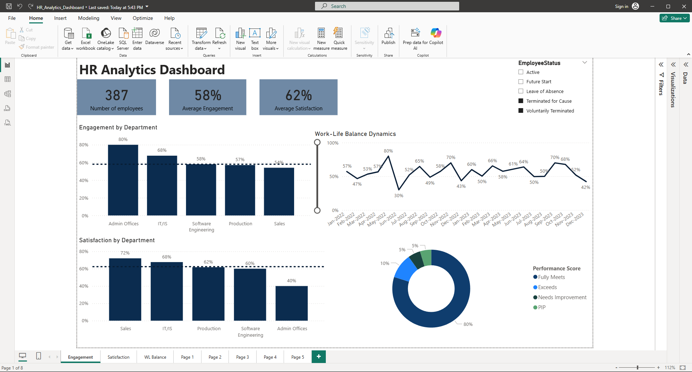
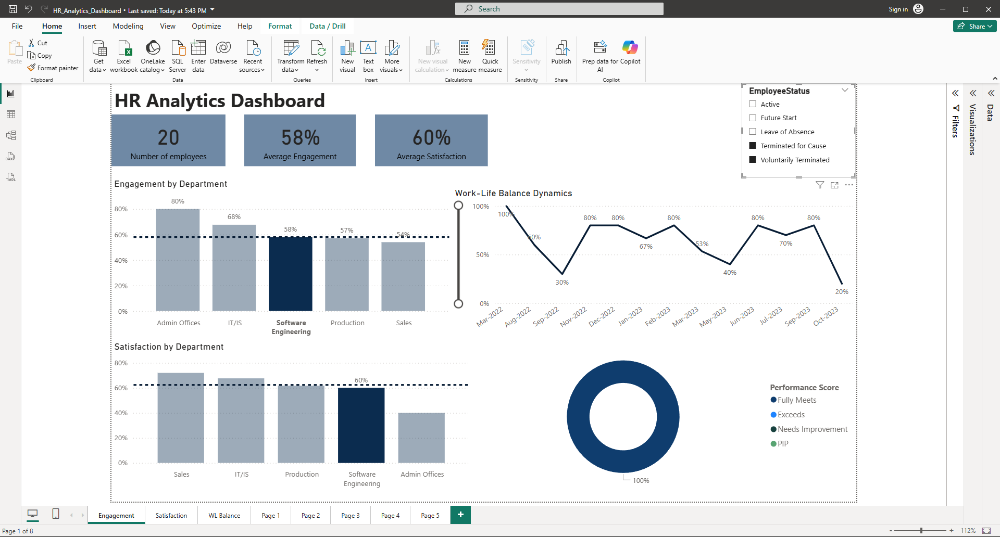

📌 Overview

This dashboard provides insights into employee engagement, satisfaction, work–life balance, and attrition, helping HR and leadership teams identify risk areas and understand the drivers behind turnover.

🎯 Key Findings

Among employees who left the company (387 total: Voluntary and Terminated by Clause), performance levels were generally high — 80% Fully Meets, 10% Exceeds, with only 10% combined in Needs Improvement and PIP. This indicates that performance was not a primary driver of attrition. 

In the Software Engineering department, employees who left show uneven work–life balance trends while maintaining 100% “Fully Meets” performance. However, engagement (58%) and satisfaction (60%) remain below optimal levels, suggesting that attrition in this area is more strongly linked to employee experience rather than performance issues. 

🧭 Usage

Filter by Employee Status to compare active vs. departed employees.

Benchmark departments against company averages.

Track trends to pinpoint experience-related attrition risks.

📈 Value

Focuses HR actions on employee experience drivers rather than performance issues, enabling targeted retention strategies.
